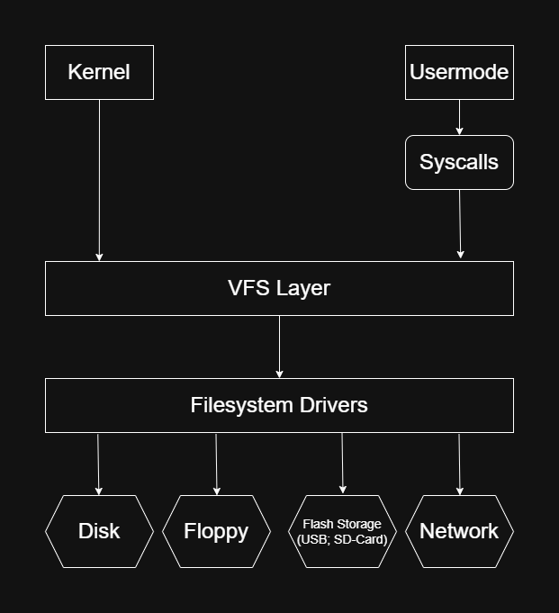

# VFS design

## Basic Design

The VFS has a design based on the [Sun Microsystems vnode paper by S.R. Kleiman](https://www.cs.fsu.edu/~awang/courses/cop5611_s2024/vnode.pdf). Which means
that it will use vnodes for accessing anything on the virtual filesystem. Below is a figure of the basic file system implementation:

 </br>
**Figure 1:** The basic VFS layout

From now on the term VFS will have the meaning of an abstraction of a filesystem on any supported storage medium.

---

The structures will be the same as the ones in the vnode paper so no need to put them here. Except the `statfs` structure which is below:

```c
struct statfs {
    uint32_t f_type;       // Filesystem type identifier
    uint32_t f_bsize;      // Optimal block size for transfers
    uint64_t f_blocks;     // Total number of blocks in the filesystem
    uint64_t f_bfree;      // Free blocks available to superuser
    uint64_t f_bavail;     // Free blocks available to non-root users
    uint64_t f_files;      // Total inodes (vnodes)
    uint64_t f_ffree;      // Free inodes (vnodes)
    uint64_t f_fsid;       // Filesystem ID
    uint32_t f_namelen;    // Maximum length of filenames
    uint32_t f_flags;      // Mount flags
    uint32_t f_spare[4];   // Padding for future expansion
};
```

**Figure 2:** Statfs structure </br>

## Paths

TODO
