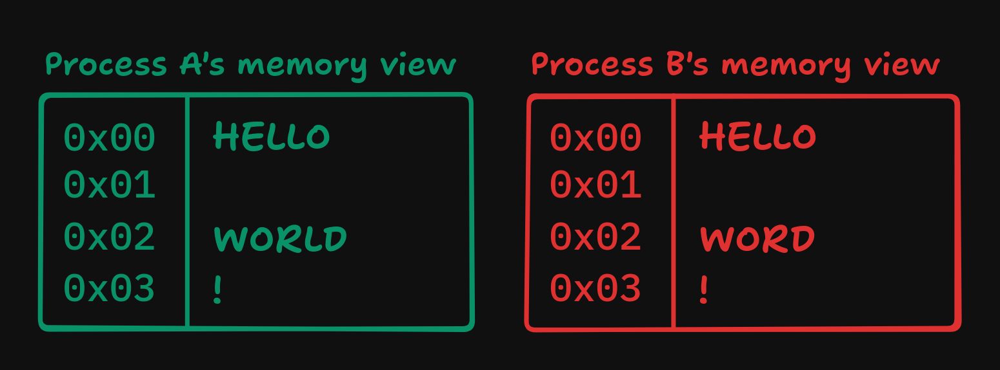
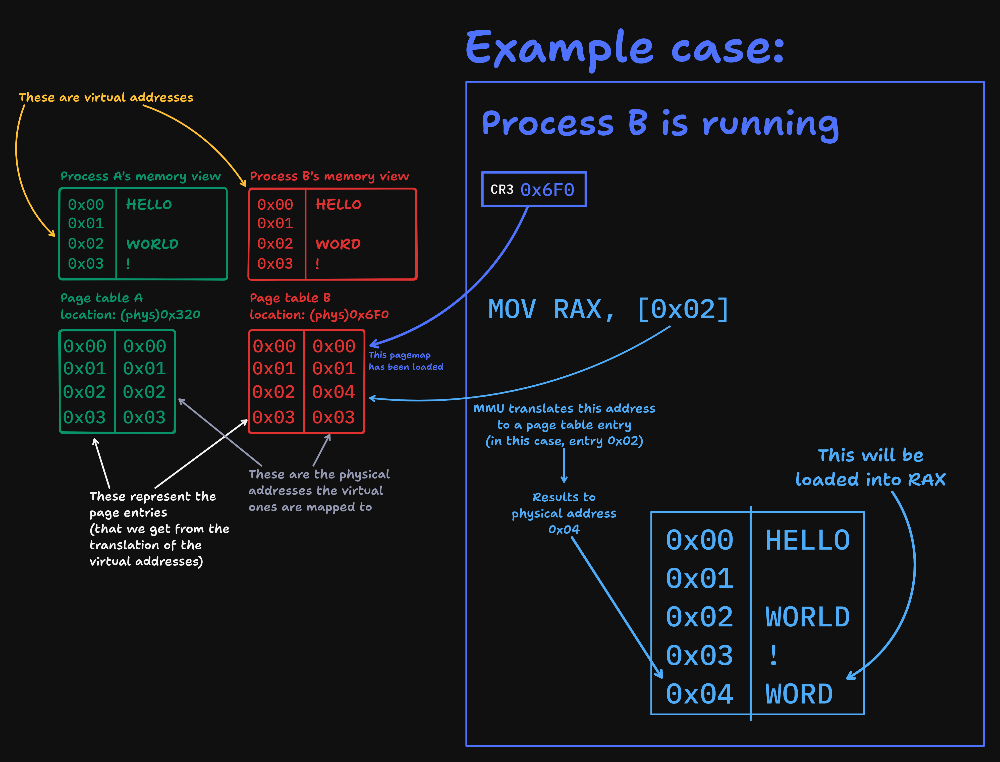

# Notes about my VMM implementation

NOTE: before you start reading, these are just a bunch of notes/points about how the VMM should work (at the time of writing, i still did not write any code yet, and maybe in case you want to understand how the implementation works or for some kind of explanation for how a VMM works in general, this is the place to go). DO NOT take this as some kind of OSDev article/blogpost to use as the only reference.

---

What's a VMM?

- Something that manages the virtual memory of a process (e.g. the kernel/any software you're running on it)
- each program can have its own view of the memory that it runs on.

You've got Process A and B running.
Say they both want to access memory at address `0x02`.
BUT, when you actually do that, they result in two different things:



According to this section of the OSDev wiki about [Memory management](https://wiki.osdev.org/Memory_management#Paging), this image


shows that each process has its own pagemap that shows how each memory address is mapped to physical memory.

Which means that when starting up a program, we should also load a page table with its memory mappings into CR3:


- also, each process should have its own virtual memory manager
- If the program asks some memory, it will first be searched in the memory range that process has been provided with. If there's not enough virtual memory, it will be requested first to the PMM, mapped to the process' page tables, and then given to the process

# The implementation

Each program will have a VM context that describes:

1. Which virtual addresses are mapped to physical ones;
2. Which virtual memory ranges are allocated and which ones aren't.

We can use a list of (virtual) memory ranges (that are mapped to physical memory) available to the program, and use some flags to track which ones are allocated and which ones aren't

```c
virtual_memory_range {
    base;                    // this is the VIRTUAL base of the range
    len;
    flags;                   // custom VMO flags

    // your usual previous and next stuff for linked lists
    virtual_memory_range* prev;
    virtual_memory_range* next;
}

virtual_memory_context {
    u64* pml4;                            // the process-specific pagemap

    virtual_memory_range* root;    // first available region
};

// flags
VMR_PRESENT         (1)
VMR_RW              (1 << 1)
VMR_USER            (1 << 2)
VMR_ALLOCATED       (1 << 3)
```

- the kernel will have its VMM too
  
  - the pagemap will be the one we used to initialize paging
  - it will work on the HHDM region (`0xffff800000000000` - `memory end`)

- each process will have its own VMM
  
  - custom pagemap (will be mapped when initializing the VMM)
  - the starting `base` will always be virtual address `0x00` and the `length` will initially be `0x1000`

VMM context initialization function prototype:

```c
vmm_ctx_init(*pagemap, flags) {
    create a new virtual_memory_context (via pmm_alloc());
    set ctx->pml4 to pagemap;

    initialize ctx->root (pmm_alloc() here too):
        -> base: 0
        -> len: 0x1000;
        -> flags: flags;

    return ctx;
}
```

This only works for non-kernel VM**C**s (**C**ontexts)

Kernel VMC init

- Kernel VMM doesn't have to be initialized

- Since kernel's PML4 is already loaded, we just have to set the VMC's root VMR
  
  More or less something like this:
  
  ```c
  // kernel code up here
  we'll use the vmm_ctx_init function anyways;
  ask an address to the PMM and we'll PHYS_TO_VIRTUAL() it;
  kernel_ctx->root->base = requested address;
  
  // more kernel code down here
  ```

### VMM Initialization

something like this:

`vmm_init(*context)`

- Here is were we're gonna map the first region to the context's PML4

- We'll load the PML4 to CR3

Prototype:

```c
vmm_init(*context) {
    is there something at context->root?
        // yes!
        ask PMM for a <root->len>bytes region;
        map it to context->pml4 as virtual address <root->base>;
        map the whole higher half (0xffff800000000000 - kernel end) to context->pml4;
    // no
    // ig we're gonna panic or initialize it

    load context->pml4 into CR3;
    // that's it (in theory)
}
```

## The virtual memory allocator

- A program is now running

- It asks for some memory (`malloc()`)

- `vmm_alloc(*ctx, size)`
  What's VMM/VMA going to do?
  
  ```c
  eg. vmm_alloc(kernel_vmm_ctx, 256) is called
  
  kernel_vmm_ctx->root_vmo
  (like before, each space is 64 bytes)
  [                                                                ]
  base:0                                                        4095
  len: 4096
  
  FLAGS: 0011
  - not allocated
  - kernel-only access
  - read/write
  - present
  
  -- FIND THE FIRST AVAILABLE REGION ---
  1. is the region allocated? NO
  2. does the requested size fit? YES!
  The region is gonna get split in two
  
   ↓ this will be marked with the ALLOCATED flag
  [XXX] [                                                             ]
  0 255 256                                                        4095
         ^ this region will be created right after the allocated one
           and will be available for the next allocation
  
  if the region is allocated/isn't large enough:
   3. Is there a ->next? YES
  
   4. no?
       PMM, gimme <requested bytes aligned to 4KiBs> bytes!
       here you go :D
  
   anyways, go to step 1
   
  ```

- We need to free memory too

- `free(*ctx, *ptr)`
  
  ```c
  eg. free(kernel_ctx, (void*)0x3C0) is called

  Example memory layout
  
  (region sizes are in hex due to space constraints)
  [XXX] [    ]  [XXXXXXX] [XXXXXXX] [                            ] [XXXX]  [XXXXXXXXXX]
  0  FF 100:1FF 200   3BF 3C0   57F 580                        CBF CC0:DBF DCO      FFF

  1. Iterate through each region
    - Does its base correspond to the allocated pointer? YES
      - Does it have a VMO_ALLOCATED flag? YES
        - Remove the flag
        - If ->prev and/or ->next are unallocated, we can just merge it all into one block
      - NO?
        - just panic or give an error
    - NO?
      - if we don't find a region corresponding the pointer, either panic or return an error

  --- Unallocating region ---
  [XXX] [    ]  [XXXXXXX] [       ] [                            ] [XXXX]  [XXXXXXXXXX]
  0  FF 100:1FF 200   3BF 3C0   57F 580                        CBF CC0:DBF DCO      FFF

  --- Merging it with ->next ---
  [XXX] [    ]  [XXXXXXX] [                                   ] [XXXX]  [XXXXXXXXXX]
  0  FF 100:1FF 200   3BF 3C0                               CBF CC0:DBF DCO      FFF

    - DONE

  ```
  
  