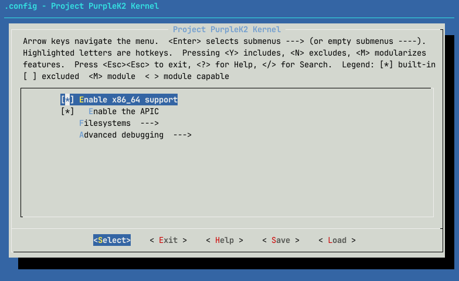
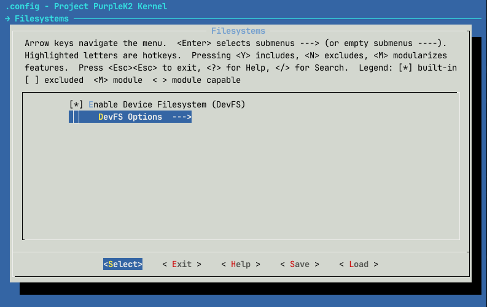
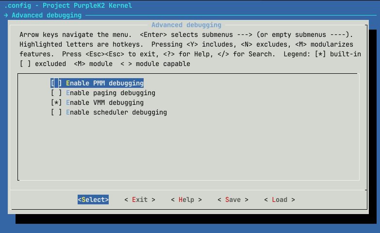

# purpleK2 - menuconfig

If you're here, then you wanted to customise some build options for purpleK2.

# Main screen

The main screen presents the following options and sections:

## Enable x86_64 support

I don't even know why Catdev put this, but ig i'll keep it. Just don't disable it or purpleK2 will be very sad (aka it will just halt at startup).

## Enable the APIC

Pretty self-explainatory, right? Obviously, this only works if you are on an x86_64 platform (the option won't even show up if x86_64 support is disabled).

## Filesystems

Managing filestems support:

(just like before, disabling DevFS support will also disable DevFS-related options)

(click to reveal) DevFS-related options:

## Advanced debugging

Related to printing more detailed information about certain kernel components:

